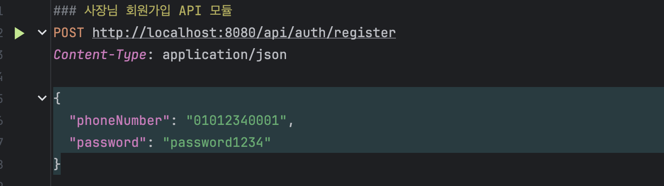

## Overview

> 효율적인 운영을 필요로 하는 사장님들을 위한 서비스입니다.

### Tech Stack

- Java 17
- Spring Boot 3
- Spring Data JPA
- Spring Security
- MySQL
- Docker
- JUnit5

---

### API Methods

### API Methods

- **인증**:
    - POST `/api/auth/register`: 소유자를 등록하기 위한 API입니다. 필요한 정보를 JSON 형식으로 전송해야 합니다.
    - POST `/api/auth/login`: 로그인을 위한 API입니다. 유효한 사용자 이름과 비밀번호를 JSON 형식으로 전송하면 JWT 토큰을 반환합니다.
    - POST `/api/auth/logout`: 로그아웃을 위한 API입니다. 현재 로그인된 사용자의 세션을 종료합니다.

- **제품 관리**(유효한 JWT로만 접근 가능):
    - POST `/api/products`: 새 제품을 등록하기 위한 API입니다. 제품에 대한 정보를 JSON 형식으로 전송해야 합니다.
    - PUT `/api/products/{id}`: 기존 제품을 수정하기 위한 API입니다. 수정하려는 제품의 ID와 변경하려는 정보를 JSON 형식으로 전송해야 합니다.
    - DELETE `/api/products/{id}`: 제품을 삭제하기 위한 API입니다. 삭제하려는 제품의 ID를 URL 경로에 포함해야 합니다.
    - GET `/api/products`: 제품 목록을 조회하기 위한 API입니다. 페이지네이션을 지원하며, 페이지 번호와 페이지 크기를 쿼리 파라미터로 전달할 수 있습니다.
    - GET `/api/products/{id}`: 특정 제품의 상세 정보를 조회하기 위한 API입니다. 조회하려는 제품의 ID를 URL 경로에 포함해야 합니다.
    - GET `/api/products/search`: 이름으로 제품을 검색하기 위한 API입니다. 검색하려는 제품의 이름을 쿼리 파라미터로 전달해야 합니다.

----

### 실행 방법

1. **도커 실행**:

- 도커가 설치되어 있지 않다면, [도커 설치](https://docs.docker.com/get-docker/)를 참조하여 설치하세요.
- 도커가 설치되어 있다면, 도커를 실행하세요.

2. **application build**:

```bash
./gradlew clean build
```

3. **Start to docker compose**:

```bash
docker-compose up
```

4**Http Client 를 활용한 API 테스트**
> Http Client는 API를 테스트하고 검증하기 위한 도구로, 인텔리제이 IDE에 내장된 기능입니다.<br>
> API 요청을 보내고 응답을 확인할 수 있으며, GUI 환경에서 쉽게 사용할 수 있습니다.<br>
> /http-client/ 경로에 있는 파일들을 Http Client에서 열어 API 검증 및 테스트를 진행합니다.
